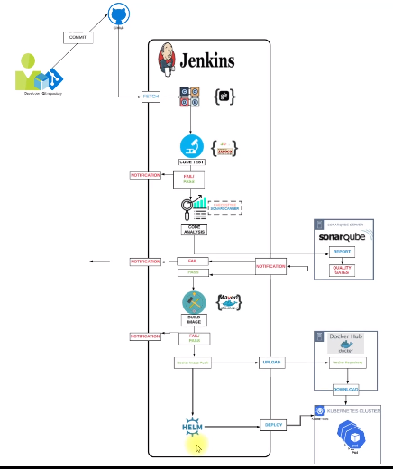

# DevOps-Zero-Advance

 https://www.udemy.com/course/decodingdevops/

 Credits: Iram

### Stack technologies
For this project

## FLOW OF EXECUTION
1. Continuous integration setup
    a. Jenkins, Sonarqube & Nexus (CI Project)
2. Dockerhub account (Containerization Project)
3. Store Dockerhub credentials in Jenkins
4. Setup Docker Engine in Jenkins
5. Install plugins in Jenkins
    a. Docker-pipeline
    b. Docker
    c. Pipeline utility
6. Create Kubernetes Cluster with Kops
7. Install Helm in Kops VM
8. Create Helm Charts
9. Test Charts in k8s Cluster in test namespace
10. Add Kops VM as Jenkins Slave
11. Create Pipeline code
12. Update Git Repository with
    a. Helm Charts
    b. Dockerfile
    c. Jenkinsfile (Pipeline code)
13. Create Jenkins job for pipeline
14. Run & Test the job.